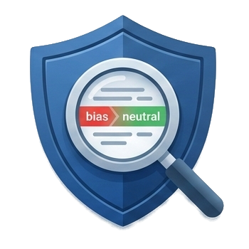
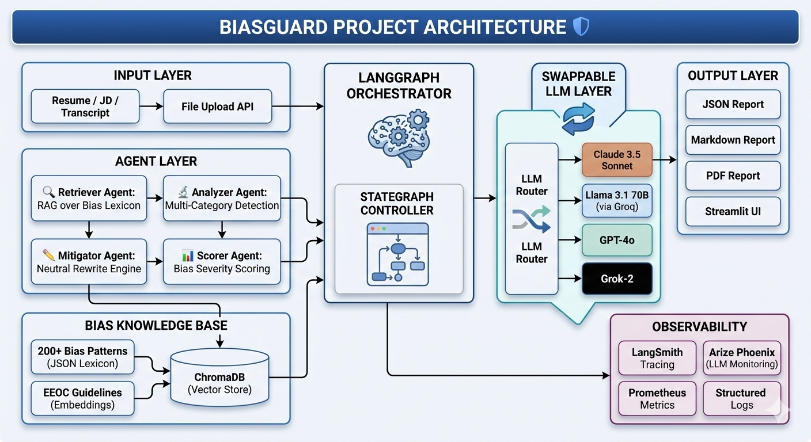
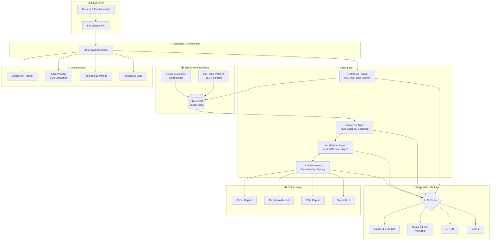
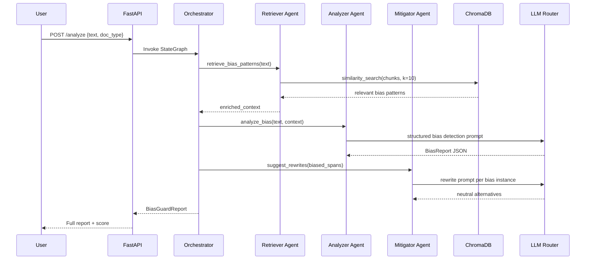

# BiasGuard 🛡️ — Bias-Detection RAG Agent for Hiring
## by [Unbiased Talent](URL "https://unbiasedtalent.com/")

<div align="center">

[](https://www.python.org/downloads/)
[](https://fastapi.tiangolo.com)
[](https://langchain.com)
[](https://langchain-ai.github.io/langgraph/)
[](https://www.trychroma.com/)
[](https://streamlit.io)
[](https://www.docker.com)
[](https://smith.langchain.com)
[](LICENSE)
[](https://github.com/sameersemna/biasguard/actions)
[](https://github.com/astral-sh/ruff)



**Production-grade, agentic RAG system that detects and mitigates hiring bias in resumes, job descriptions, and interview transcripts.**

[Live Demo](#) · [Documentation](docs/) · [Report Bug](issues/) · [Request Feature](issues/)

</div>

---

## Why This Matters

Hiring bias costs organizations in ways both ethical and financial. Studies show that:

- **Résumés with "white-sounding" names** receive 50% more callbacks (Bertrand & Mullainathan, 2004)
- **Gender-coded language** in job postings reduces female applicant pools by up to 42%
- **Age bias** language eliminates qualified senior candidates before a single interview
- **US EEOC charges** cost Fortune 500 companies $3.8B annually in settlements

BiasGuard puts Responsible AI into practice at the point where it matters most — the hiring pipeline. It is not a governance checkbox. It is an operationalized, agent-driven system that catches what humans miss and explains *why* something is biased, *how* it harms specific groups, and *what* to write instead.

This project is built to the standard expected of a Principal MLOps/GenAI engineer: observable, testable, containerized, swappable, and production-deployable on day one.

---

## Architecture





### Agent Interaction Flow



---

## Tech Stack

| Layer | Technology | Purpose |
|---|---|---|
| **Orchestration** | LangGraph 0.1 | Stateful agentic DAG |
| **LLM Framework** | LangChain 0.2 | Chains, prompts, tools |
| **Vector DB** | ChromaDB (local) / Pinecone (cloud) | Bias pattern retrieval |
| **LLMs** | Claude 3.5, Llama 3.1 70B, GPT-4o, Grok-2 | Swappable via router |
| **API** | FastAPI + Uvicorn | Production REST API |
| **Frontend** | Streamlit | Interactive demo UI |
| **Tracing** | LangSmith + Arize Phoenix | LLM observability |
| **Metrics** | Prometheus + Grafana | Ops monitoring |
| **Testing** | Pytest + pytest-asyncio | Unit + integration tests |
| **CI/CD** | GitHub Actions | Automated test + lint |
| **Containers** | Docker + Docker Compose | Local + cloud deploy |
| **Embeddings** | `text-embedding-3-small` / `nomic-embed-text` | Bias KB embeddings |
| **Reports** | Markdown + WeasyPrint PDF | Shareable output |

---

## Project Structure

```
biasguard/
├── agents/
│   ├── __init__.py
│   ├── retriever_agent.py       # RAG over bias lexicon
│   ├── analyzer_agent.py        # Multi-category bias detection
│   ├── mitigator_agent.py       # Neutral rewrite suggestions
│   ├── scorer_agent.py          # Severity scoring + ranking
│   └── orchestrator.py          # LangGraph StateGraph controller
├── api/
│   ├── __init__.py
│   ├── main.py                  # FastAPI app entrypoint
│   ├── routes/
│   │   ├── analyze.py           # /analyze endpoint
│   │   ├── health.py            # /health + /metrics
│   │   └── reports.py           # /reports CRUD
│   ├── models.py                # Pydantic request/response models
│   └── middleware.py            # Auth, CORS, rate limiting
├── bias_db/
│   ├── __init__.py
│   ├── bias_db.py               # ChromaDB interface
│   ├── embedder.py              # Embedding pipeline
│   ├── ingest.py                # KB ingestion script
│   └── knowledge_base/
│       ├── bias_patterns.json   # 200+ bias indicators
│       ├── eeoc_guidelines.json # EEOC framework
│       └── rewrite_templates.json
├── config/
│   ├── __init__.py
│   ├── settings.py              # Pydantic Settings (env-driven)
│   └── llm_router.py            # Swappable LLM factory
├── data/
│   ├── inputs/
│   │   ├── sample_resume_biased.txt
│   │   ├── sample_jd_biased.txt
│   │   └── sample_transcript_biased.txt
│   └── outputs/
│       ├── example_output_resume.json
│       ├── example_output_jd.md
│       └── example_output_transcript.pdf
├── evaluation/
│   ├── eval_dataset.json        # Ground-truth bias annotations
│   ├── evaluator.py             # LangSmith eval harness
│   └── metrics.py               # Precision, recall, F1 for bias
├── frontend/
│   └── streamlit_app.py         # Interactive Streamlit demo
├── monitoring/
│   ├── phoenix_tracer.py        # Arize Phoenix setup
│   ├── langsmith_tracer.py      # LangSmith callbacks
│   └── prometheus_metrics.py    # Custom metrics
├── tests/
│   ├── unit/
│   │   ├── test_retriever.py
│   │   ├── test_analyzer.py
│   │   └── test_mitigator.py
│   └── integration/
│       ├── test_api.py
│       └── test_pipeline.py
├── scripts/
│   ├── ingest_kb.sh             # One-shot KB ingestion
│   └── generate_report.py       # CLI report generator
├── docker/
│   ├── Dockerfile.api
│   ├── Dockerfile.frontend
│   └── nginx.conf
├── .github/
│   └── workflows/
│       ├── ci.yml
│       └── docker-publish.yml
├── docker-compose.yml
├── docker-compose.prod.yml
├── requirements.txt
├── requirements-dev.txt
├── .env.example
├── pyproject.toml
├── Makefile
└── README.md
```

---

## Quick Start

### Prerequisites
- Python 3.11+
- Docker & Docker Compose
- An API key for at least one supported LLM provider

### 1. Clone & Configure

```bash
git clone https://github.com/sameersemna/biasguard.git
cd biasguard
cp .env.example .env
# Edit .env with your API keys
```

### 2. Run with Docker (Recommended)

```bash
# Start all services (API + Frontend + ChromaDB + Monitoring)
docker compose up --build

# API:       http://localhost:8000
# Frontend:  http://localhost:8501
# Grafana:   http://localhost:3000
# Phoenix:   http://localhost:6006
```

### 3. Run Locally

```bash
# Install dependencies
python -m venv .venv && source .venv/bin/activate
pip install -r requirements.txt

# Ingest the bias knowledge base
bash scripts/ingest_kb.sh

# Start API
uvicorn api.main:app --reload --port 8000

# Start Streamlit (separate terminal)
streamlit run frontend/streamlit_app.py
```

### 4. Analyze a Document (CLI)

```bash
# Analyze a job description
curl -X POST http://localhost:8000/analyze \
  -H "Content-Type: application/json" \
  -d '{
    "text": "We need a young, energetic rockstar developer...",
    "doc_type": "job_description",
    "llm_provider": "openai"
  }'

# Or use the Python client
python scripts/generate_report.py \
  --input data/inputs/sample_jd_biased.txt \
  --doc-type job_description \
  --output-format pdf
```

---

## Bias Categories Detected

BiasGuard detects bias across 8 primary categories with 200+ indicators:

| Category | Examples |
|---|---|
| **Gender Bias** | "rockstar", "ninja", "dominant", gender-coded adjectives |
| **Age Bias** | "young", "digital native", "recent graduate", graduation year filters |
| **Race/Ethnicity** | "culture fit", ambiguous name-related assumptions, coded language |
| **Disability** | "able-bodied", "walk-in interviews", inaccessible requirements |
| **Socioeconomic** | Unpaid internship as requirement, "elite university", class-coded terms |
| **National Origin** | "native English speaker", citizenship requirements exceeding legal need |
| **Appearance** | Photo requirements, "professional appearance", BMI references |
| **Cognitive Style** | "fast-paced", "work hard, play hard", neurotypical assumptions |

---

## Example Outputs

### Job Description Analysis

**Input (Biased):**
> "We're looking for a **young, energetic rockstar** developer who can hit the ground running. Must be a **culture fit** with our startup family. **Native English speaker** preferred. Looking for **recent graduates** who want to **work hard, play hard**."

**Output Summary:**
```json
{
  "bias_score": 0.87,
  "severity": "HIGH",
  "bias_instances": [
    {
      "span": "young, energetic",
      "category": "AGE_BIAS",
      "severity": "HIGH",
      "explanation": "Explicitly excludes candidates over ~35. Violates ADEA.",
      "rewrite": "motivated, results-driven"
    },
    {
      "span": "rockstar",
      "category": "GENDER_BIAS",
      "severity": "MEDIUM",
      "explanation": "Male-coded term that reduces female applicant pool by 18%.",
      "rewrite": "exceptional engineer"
    },
    {
      "span": "culture fit",
      "category": "RACIAL_BIAS",
      "severity": "HIGH",
      "explanation": "Subjective criterion correlated with in-group favoritism and racial bias.",
      "rewrite": "values alignment (specify: collaborative, transparent, accountable)"
    }
  ]
}
```

**After (Debiased):**
> "We're looking for a **motivated, results-driven engineer** who can contribute immediately. We seek **values alignment** around collaboration, transparency, and accountability. All qualified candidates are encouraged to apply."

---

## MLOps & Observability

BiasGuard is built with production observability from day one:

**LangSmith Tracing** — Every agent call, retrieval, and LLM inference is traced with full input/output capture and latency profiling.

**Arize Phoenix** — LLM-specific monitoring including embedding drift detection, prompt/response logging, and bias metric dashboards.

**Prometheus + Grafana** — Custom metrics: `biasguard_analyses_total`, `biasguard_bias_score_histogram`, `biasguard_llm_latency_seconds`, `biasguard_high_severity_alerts_total`.

**Evaluation Harness** — Ground-truth annotated dataset with automated precision/recall evaluation via LangSmith Datasets API. Target: F1 > 0.85 on held-out test set.

---

## Configuration

All configuration is environment-driven via `.env`:

```bash
# LLM Provider (anthropic | openai | groq | xai)
LLM_PROVIDER=anthropic
LLM_MODEL=claude-3-5-sonnet-20241022

# Fallback LLM
FALLBACK_LLM_PROVIDER=groq
FALLBACK_LLM_MODEL=llama-3.1-70b-versatile

# Vector DB (chroma | pinecone)
VECTOR_DB=chroma
CHROMA_PERSIST_DIR=./data/chroma_db

# Observability
LANGSMITH_API_KEY=your_key
LANGSMITH_PROJECT=biasguard-prod
PHOENIX_COLLECTOR_ENDPOINT=http://localhost:6006

# API Security
API_SECRET_KEY=your_secret
ALLOWED_ORIGINS=http://localhost:8501
```

---

## Contributing

Contributions are welcome. Please read [CONTRIBUTING.md](CONTRIBUTING.md) and open a PR against `main`.

Areas of focus:
- Expanding the bias knowledge base (more languages, more categories)
- Adding bias detection for audio/video transcripts via Whisper
- Fine-tuning a small open-source model specifically for bias classification
- Multilingual bias detection

---

## Responsible AI Disclosure

BiasGuard is a tool to *assist* human reviewers — it is not a replacement for human judgment in hiring decisions. All outputs should be reviewed by qualified HR professionals. The bias knowledge base reflects current research but is not exhaustive. False positives and false negatives are possible.

The authors are committed to maintaining and improving the accuracy of this system and welcome community contributions to the knowledge base.

---

## Citation

```bibtex
@software{biasguard2024,
  title = {BiasGuard: Bias-Detection RAG Agent for Hiring},
  author = {Your Name},
  year = {2024},
  url = {https://github.com/sameersemna/biasguard},
  license = {MIT}
}
```

---

## License

MIT License — see [LICENSE](LICENSE) for details.

---

<div align="center">
Built with ❤️ for a more equitable future in hiring.
</div>
